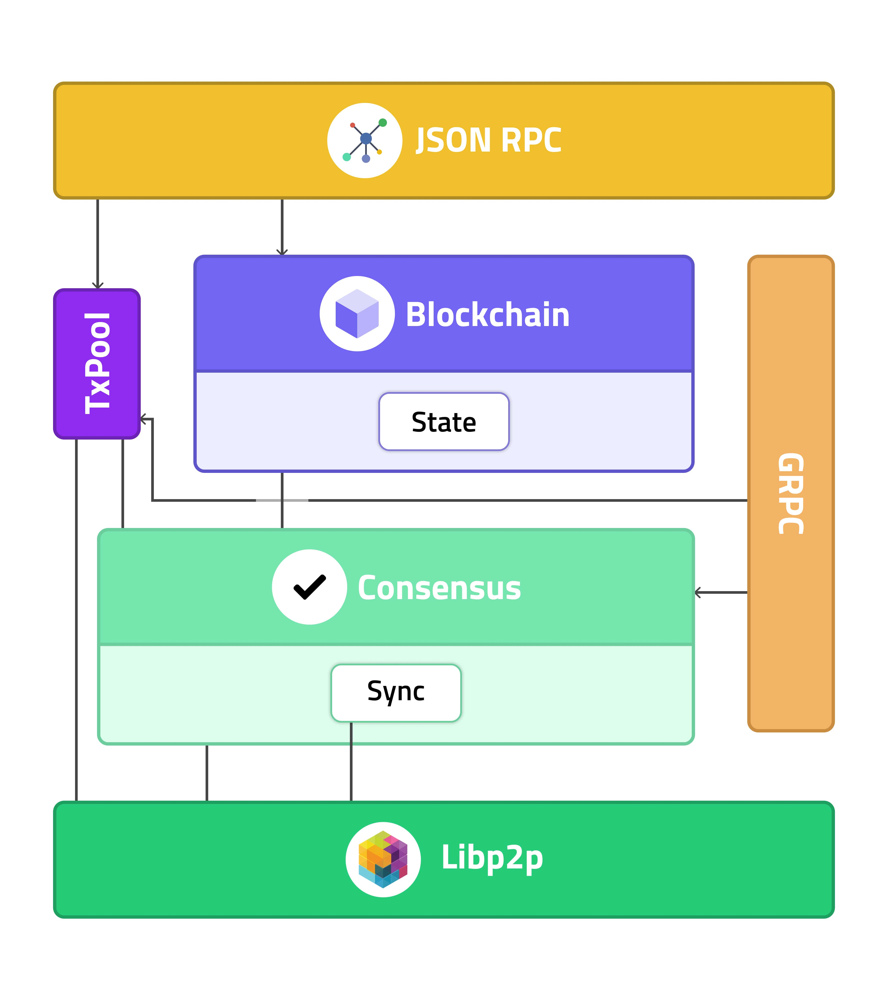

GEN-X is a Polygon Supernet based network developed with Polygon Edge. Polygon Edge is a powerful framework allowing you to run your blockchain network with customizable features. It is designed with a modular architecture. Additionally, Polygon Edge is fully compatible with Ethereum, enabling you to bring your Ethereum smart contracts with you and interact with industry-standard wallets through JSON-RPC. You can also develop using Solidity or Vyper and take advantage of the full EVM support and widely-adopted Ethereum tooling, libraries, and development tools. Plus, the user experience is streamlined when performing cross-chain operations.

One of the critical benefits of Polygon Edge is the ability to customize your network with plugins. You can change the core functionalities of your network by developing Consensus plugins or even go beyond Ethereum's capabilities with Runtime plugins. This means you don't have to fork your network to make changes, making developing new features more manageable and cost-effective. Polygon Edge has a developer-friendly plugin system, making it easier for you to build and deploy your plugins.

Another advantage of Polygon Edge is its built-in Bridge solution, which allows for entirely trustless and decentralized cross-chain communication, enabling Gaia-X networks to communicate with each other. You can transfer assets to and from any EVM-compatible network. This means that you can transfer data tokens and data NFTs between networks.

# Component overview

Polygon Edge is designed in a modular fashion so that you can benefit from developments by the community but also focus on developing your solutions without the need to care about other aspects.

### Libp2p

It all starts at the base networking layer, which utilizes libp2p. It fits into the designing philosophies of Polygon Edge as Libp2p is modular, extensible and fast.

### Synchronization & Consensus

The separation of the synchronization and consensus protocols allows for modularity and implementation of custom sync and consensus mechanisms - depending on how the client is being run. Polygon Edge is designed to offer off-the-shelf pluggable consensus algorithms. Polygon Edge currently supports two consensus algorithms, namely IBFT Proof of Authority and IBFT Proof of Stake.

### Blockchain

The Blockchain layer is the central layer that coordinates everything in the Polygon Edge system. It is covered in depth in the corresponding Modules section.

### State 

The State inner layer contains state transition logic. It deals with how the state changes when a new block is included. It is covered in depth in the corresponding Modules section.

### JSON RPC

The JSON RPC layer is an API layer that dApp developers use to interact with the blockchain. It is covered in depth in the corresponding Modules section.

### TxPool

The TxPool layer represents the transaction pool, and it is closely linked with other modules in the system, as transactions can be added from multiple entry points.

### GRPC

The GRPC layer is vital for operator interactions. Through it, node operators can easily interact with the client, providing an enjoyable UX.

# General Purpose Solutions and Customizable Blockchains
Building a custom blockchain using Polygon Edge can offer several advantages compared to forks of general-purpose networks like Ethereum.

First, building a custom blockchain using Polygon Edge allows for greater flexibility and customization. With Polygon Edge, you can build a blockchain tailored to specific business needs and requirements rather than being limited to the features and functionality of an existing blockchain. This can be particularly useful if you have specific use cases or requirements not supported by existing blockchain networks. It can also improve throughput and security and facilitate development.

Second, building a custom blockchain using Polygon Edge can be more cost-effective than a fork, e.g., Ethereum. Forks require significant time and resources to develop and maintain and can be costly to implement. By contrast, building a custom blockchain using Polygon Edge allows you to leverage the existing infrastructure and technologies of the Polygon Edge framework, making it faster and more cost-effective to develop and maintain your blockchain. As Polygon Edge is built using a Plugin system, one can also benefit from contributions by others and re-use plugins.  

Third, building a custom blockchain using Polygon Edge can be more secure compared to a fork of Ethereum. Forks introduce new code and potentially untested changes to the existing blockchain, which can introduce new vulnerabilities and risks. By contrast, building a custom blockchain using Polygon Edge allows you to design and implement a specifically designed blockchain to be secure and resistant to potential attacks.

Overall, building a custom blockchain using Polygon Edge can offer a range of advantages compared to a fork of a general-purpose solution like Ethereum, including greater flexibility and customization, cost-effectiveness, and security. It is a valuable option for developers and organizations looking to build a blockchain tailored to their specific needs and requirements.
